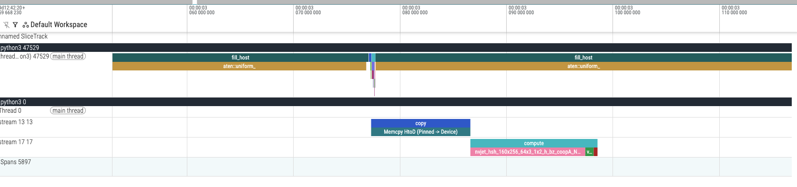
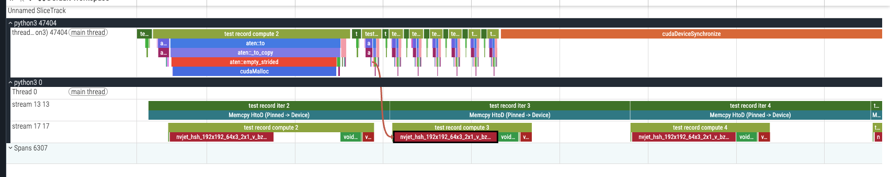

# PyTorch CUDA Streams Overlap Demo: `1_no_overlap.py` vs `2_overlap.py`

This repo demonstrates a subtle but important point:

> **Using multiple CUDA streams does NOT automatically create overlap.**  
> To get **real time overlap** (Memcpy HtoD overlapping with GPU compute), you must structure work as a **pipeline** (e.g., double-buffering) so that **copy(next)** can run while **compute(prev)** runs.

We provide two scripts:

- `1_no_overlap.py` — **No overlap (baseline / common pitfall)**
- `2_overlap.py` — **Has overlap (correct pipeline)**

Both scripts export a profiler trace (Chrome trace) and we include screenshots from the trace.

---

## What differs between the two scripts

### A) Dependency graph (the real reason)

#### `1_no_overlap.py` (serialized)
Each iteration uses the **same buffer** for both copy and compute, and the compute stream waits for the **same iteration's** copy event.

**Per-iteration dependency:**


Because `compute(i, buf)` must wait for `copy(i, buf)`, the memcpy and compute in that iteration **cannot overlap**.

In practice you’ll see:
- `Memcpy HtoD (Pinned -> Device)` finishes
- then the GEMM / compute kernel starts

---

#### `2_overlap.py` (pipelined overlap)
This script uses **double-buffering + prefetch**. The key change is:

- enqueue `copy(i, cur_buf)` for the *next* work
- simultaneously run `compute(i-1, prev_buf)` on the *previous* buffer

**Cross-iteration pipeline:**
copy(i-1, prev) --> compute(i-1, prev) (correctness)
copy(i, cur) || compute(i-1, prev) (independent => can overlap)

So `copy(i)` and `compute(i-1)` have **no dependency** and can execute concurrently (hardware/resources permitting).

---

### B) Why we need two host tensors (h0/h1) and two device tensors (d0/d1)

To pipeline safely, CPU and GPU must not contend on the same host buffer:

- While GPU DMA is reading `h0` for `Memcpy HtoD`,
- CPU (or dataloader) should be free to prepare the next batch into `h1`.

If you reuse a single `h0` and also modify it while the copy is in flight, you risk:
- data races / corrupted transfers
- or you are forced to add synchronization, which destroys overlap

Double-buffering avoids both problems.

---

## What differs in the result (trace screenshots)

### `1_no_overlap.py` expected trace behavior
In the CUDA timeline:
- The big `Memcpy HtoD (Pinned -> Device)` region appears
- The compute kernel (e.g., `cublasGemmEx` or a GEMM kernel name) starts **after** memcpy completes
- Minimal/no time overlap between them

**Screenshot (no overlap):**


What to look for:
- Memcpy bar ends before compute bar begins
- Even if streams are different, the bars are mostly back-to-back (serialized)

---

### `2_overlap.py` expected trace behavior
In the CUDA timeline:
- While `Memcpy HtoD` for buffer `cur` is running,
- compute (GEMM) for buffer `prev` is running in parallel on another stream lane
- You can see these bars **overlapping in time**

**Screenshot (with overlap):**


What to look for:
- `Memcpy HtoD` and `cublasGemmEx` / compute kernels overlap across time
- Overlap is easiest to see when zoomed out to include multiple iterations
- you can also see that customized record names like "test record iter2" or "test record compute2 " on top of the actuall kernel runs

---

## Why pinned memory matters (but is not enough)

Both scripts typically use:
- host tensors allocated with `pin_memory=True`
- `.copy_(..., non_blocking=True)` or `.to(..., non_blocking=True)`

Pinned memory is required so H2D transfers can truly run asynchronously (via DMA) and use the copy engine.

However:

> **Pinned + non_blocking only enables async copy.**
> It does NOT guarantee overlap unless the schedule has independent work (pipeline).

So:
- `1_no_overlap.py`: async copy exists, but compute waits → no overlap
- `2_overlap.py`: async copy + independent compute from previous iteration → overlap

---

## How to reproduce

Run each script and open the exported trace:

```bash
python 1_no_overlap.py
python 2_overlap.py

